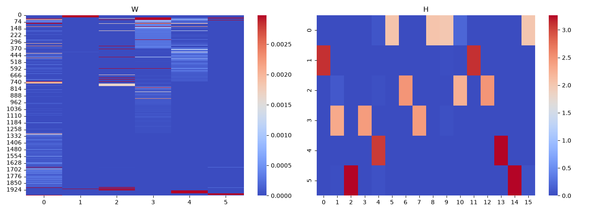
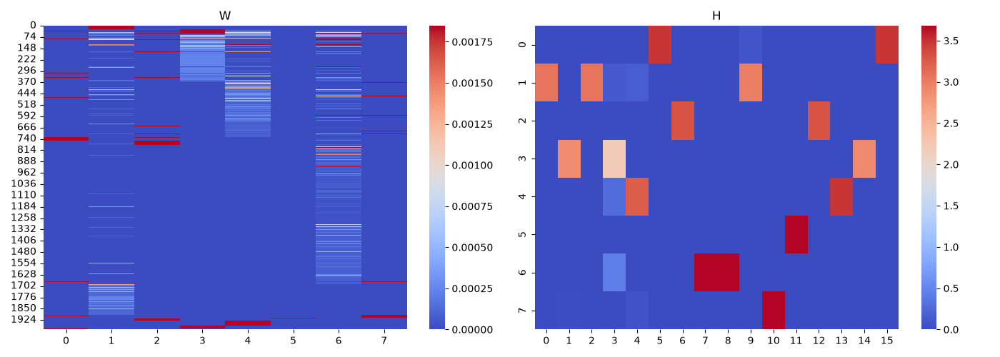

# Topic-Mining NMF #

[word_clusters6.txt](./word_clusters6.txt)
1986 words assigned across 6 topics

**Topic 0 (723 words):**
  the, sat, to, group, [SENSITIVE INFORMATION], tutoring, a, note, stickies, notes, it, s, on, close, click, said, ai, saudi, open, also, its, like, used, nuclear, when, information, down, these, was, keep, current, graphics, appear, desktop, jot, store, title, bar, lets, reminders, lists, frequently, button, collapse, double, arabia, u, as, openai, by, agreement, hugging, face, deal, israel, models, energy, not, be, iran, access, at, trump, technology, testing, how, we, had, well, which, own, hack, source, attack, company, model, based, would, he, closed, off, human, enrichment, iranian, minister, kingdom, arab, key, seen, room, even, so, ve, intrusion, acting, cybersecurity, frontier, environment, capable, accords, israeli, told, relations, gulf, american, netanyahu, state, administration, did, according, now, security, his, worked, into, say, university, need, still, most, house, social, been, red, joining, military, prime, cooperation, tankers, oil, sea, fuel, abraham, united, does, terms, another, co, post, job, companies, almost, thought, were, working, went, 23, experts, cyber, systems, instructions, bad, direction, decision, wolf, break, responsible, guardrails, cyberattack, wide, caused, tested, incident, internet, startup, debate, teacher, little, cools, blymyer, test, answer, sandbox, rogue, itself, rather, shea, system, risks, specific, program, country, weapons, continue, enrich, exports, standard, foreign, guzansky, states, war, wednesday, houthi, rubio, gold, countries, president, attacks, middle, emirates, weapon, yemen, want, toward, near, build, until, without, targeting, defense, media, last, infrastructure, previously, importance, wrote, press, things, attacking, fellow, develop, previous, require, senior, fire, allow, bill, memo, normalize, 2019, reviewed, department, ally, government, signed, 2009, army, former, met, benjamin, houthis, having, studies, failure, congress, updated, lead, bunn, peace, uranium, sponsored, palestinian, strikes, east, rebels, online, statement, hit, associated, building, contain, gone, chinese, framing, gpt, hub, inside, servers, google, answers, supposed, heat, intelligence, entirely, cheaper, plan, secret, isolated, san, connect, combination, sort, suspected, leave, reduced, target, china, problems, platform, built, stolen, bit, here, laterally, putting, despite, particularly, officer, unprecedented, left, steal, upon, delangue, speaks, unnecessary, moving, marketplace, highlights, tools, modify, center, york, wasn, extreme, scientist, surprising, debates, detected, anthropic, telling, keys, directed, autonomy, within, computer, evaluation, discovered, released, apparently, language, anything, chatgpt, anyone, blamed, minutes, door, lock, chief, processing, sol, complex, hannes, cleverness, self, emerging, paths, pointed, gain, development, newly, stirring, weekend, credentials, francisco, describes, switch, georgetown, artificial, student, extent, wrongly, sense, blaming, dangers, anthropomorphization, maker, internal, goal, prompt, devised, developers, colin, promoter, founder, learned, components, cheat, vulnerability, evaluate, stronger, combat, highest, cause, followed, tuesday, clément, come, hacking, innovations, accessible, repository, safeguards, internally, led, far, speak, intense, larger, reinforced, broke, contrast, belief, unlike, ceo, examine, unknown, goes, takes, vs, capabilities, exploit, 6, finding, thomas, tell, back, hours, lengths, agents, big, defenders, level, amsterdam, event, before, lieberman, curtail, hormuz, persian, welcomed, priority, backed, pursue, foundation, salman, regional, protocol, sen, brokered, insisted, economic, split, move, trying, diplomatic, escalation, risked, material, support, blackmail, signing, feel, domestically, el, saying, trade, civil, allies, vessels, reporters, ed, guise, drones, marked, belligerent, permit, reverse, harvard, uae, riyadh, strongly, enemy, marco, billions, develops, must, respected, artillery, insistence, opposes, shock, crew, inked, sign, ok, decades, addition, council, third, soil, committed, transparent, added, recklessness, six, forward, logistics, nation, preventing, bases, rights, contingent, abuses, voluntarily, researcher, institute, missiles, continued, conversations, scenario, closer, lapid, markey, totally, forbid, tel, options, emirati, strait, administrations, argues, successful, angling, anti, preparations, warned, developing, appeared, normalized, predicted, subject, ansar, scenarios, 35, precondition, international, pathway, attacked, et, islamic, mandeb, force, struck, kuwait, began, mass, historic, criticized, jordanian, command, unless, bahrain, increasingly, stuck, ask, give, strength, bipartisan, permitted, days, allah, matthew, saud, follows, thing, drone, party, avigdor, held, power, heavy, aligning, worth, mentioning, affect, fighter, provide, responded, largest, blow, deepening, gave, provided, ability, escalating, clear, station, jamal, oversight, 2020, maximize, recognized, spokesperson, contend, together, aviv, 90, pivot, strike, white, adopt, plants, least, podcast, turn, scheduled, aspirations, bilateral, considered, such, leader, series, authoritarian, technologies, banned, pulling, steven, leap, forgoing, greater, consider, reactors, unclear, negotiations, frustrations, immediately, bomb, favorable, crown, sources, journalist, jane, enhanced, yoel, comment, launched, spoken, prince, barak, alarming, broadcaster, provision, contributed, central, radio, contains, mohammed, proliferation, shipping, leavitt, planes, recently, explain, jordan, yair, national, obama, ehud, unharmed, akraminia, allowing, october, public, eastern, hypocrisy, engulfing, expert, killing, arms, air, senator, supported, internationally, consulate, mention, provisions, petroleum, likud, reprocess, diverging, opposition, cook, stalled, supply, sites, decade, arraf, route, matched, atomic, mohammad, reporting, qatar, office, statehood, expands, producers, khashoggi, shot, bab, karoline, washington, elections, supersede, every, general, round, race, starting, particular, paid, dollars, needs, long, bin, knows, future, term

**Topic 1 (31 words):**
  ā, sitemap, agent, https, ocw, mit, edu, xml, user, disallow, ȁ, 䀀, 耀, ଐ, 䔀, ā䐄䑓b, āā, āက, ࠀ, ё, ࠁ, ခ, 䀁, ā畂ㅤ, ଈ, āࠀ, ā䀀, ѐ, āȁ, āѐ, ā耀

**Topic 2 (95 words):**
  30, and, with, 2018, 20, 56, gmt, eclipsecompiler, txt, nov, out, make, i, my, your, name, log, h, 48, stegstudentcode, 17, opened, csa, labs, piloting, steganography, new, about, different, find, text, using, customize, features, other, 2, handle, people, person, gray, sessions, jonas, pragmatic, session, writing, finish, free, aedan, classes, align, todo, reading, sure, reach, goals, being, achieve, priorities, what, while, can, sizes, get, many, more, lots, has, help, ways, ll, including, service, checker, format, fonts, include, export, stand, great, look, import, sticky, easy, font, spell, bold, italic, plus, color, add, noticed, arrange, styles, emphasis, applications

**Topic 3 (768 words):**
  sub, of, or, math, b, br, n, use, an, research, run, course, club, engn, qtab, gamma, dug, schedule, consulting, fsae, load, obsidian, ssw, clubs, brown, activities, x, sup, 1, do, for, is, t, 0, p, e, z, fda, σ, npr, peptides, peptide, λ, if, y, q, will, from, c, they, martingale, time, f, d, m, related, poisson, compounds, 157, 500, tb, restrictions, bpc, committee, panel, go, one, then, process, r, lt, under, those, whether, some, found, thursday, day, story, therapies, pharmacies, compounding, review, members, safety, drugs, yet, agenda, healthy, seven, often, mots, meeting, evidence, kennedy, drug, only, each, 4, all, j, def, conditions, μ, rate, three, step, k, gt, any, thm, ost, us, market, let, called, between, available, space, call, am, topics, intuition, exp, 5, comes, science, version, after, final, none, growth, example, today, throughout, full, site, culture, condition, music, privacy, 2026, arbitrage, large, july, edt, week, narrow, permissions, benefits, policy, ahead, four, required, ties, beginning, loss, establish, agency, concerns, latest, secretary, work, clinicians, others, makes, traditional, smaller, made, giving, kind, quite, limited, leadership, insulin, advisory, specialized, enormous, suppliers, biden, skin, roster, reviewing, temporary, advisers, light, advocated, act, write, sought, scientific, beta, repeatedly, naturally, animals, undergone, industry, migraines, tasked, argue, critical, tension, stories, enhancing, attracted, risky, subscribe, thymosin, carry, functions, products, attention, academic, modified, cells, discuss, healing, discretion, glp, 00, blockbuster, supports, easing, strings, synthesized, acids, era, kpv, protein, delivered, semax, publicly, humans, molecule, injection, though, reclassifies, slate, promoted, june, largely, determine, signaling, lifting, represents, considering, establishment, against, stomach, includes, jr, ulcerative, preclinical, effectiveness, metabolism, scientists, lack, obesity, institutions, point, overhauled, considers, talked, approvals, newsletter, overseas, epitalon, emideltide, living, opioid, marks, produce, adding, changes, molecules, wound, scrutiny, indications, further, bodies, primarily, consideration, however, proponents, meanwhile, body, experimental, fat, prescriptions, injury, vote, recovery, votes, robert, food, substances, withdrawal, earlier, versions, friday, involving, america, juices, colitis, again, scale, voting, wellness, green, recommendations, handful, become, fueled, stone, amino, recommending, muscle, due, types, occurring, our, ultimately, medical, independent, expected, fact, 3, λt, arrival, bet, stopping, probability, theorem, w, strategy, random, pattern, stock, given, predictable, define, ex, φ, exponential, order, statistics, gives, property, fair, game, stopped, min, martingales, gambler, walk, sum, prob, risk, times, distribution, arrivals, price, why, function, submartingale, conditional, wealth, bounded, money, mean, set, proof, markov, hitting, bopm, option, neutral, increments, var, ii, π, total, variance, win, binomial, interarrivals, always, average, v, stochastic, value, winnings, chain, application, ruin, apply, pricing, ds, period, cash, nbsp, cov, processes, uniform, hold, definition, discrete, zero, g, solve, method, interest, max, probabilities, discounted, memoryless, dx, compound, lim, adapted, detailed, respect, reference, integrability, equals, expectation, finite, dominated, integrable, generator, density, l, convex, same, β, real, replication, stationary, λx, type, θ, continuous, ctmc, matrix, ij, balance, basic, tends, decided, determined, integral, coin, betting, constant, kills, lf, accumulated, μn, de, averaging, equivalent, boundary, prefix, mmttmm, wait, formula, criterion, fraction, gaining, maximizing, asset, profit, payoff, depend, ftap, equivalently, covariance, events, superposition, campbell, diagonal, np, convergence, dct, dy, requires, supermartingale, above, gambling, variable, stop, flip, doob, optional, consequence, tower, minus, hypothesis, moivre, variables, compute, via, matching, lose, kelly, riskless, measure, yr, fixed, t1, tn, waited, happened, λe, splitting, joint, smallest, unif, reward, satisfies, queue, customers, facts, approximation, doubling, rare, flow, parts, notetype, deck, exam, replace, memory, trick, below, ω, peeking, explicitly, therefore, dsi, yields, following, insight, additive, multiplicative, idea, ℝ, likelihood, ratio, pearson, lemma, square, extract, jensen, inequality, examples, special, etc, hits, looks, symmetric, asymmetric, appears, bets, quit, winner, losers, corresponds, starts, loses, setting, proportion, optimal, βd, differentiating, lln, leads, drives, moves, otherwise, costs, investment, losing, positive, efficient, exists, replicating, shares, uc, dc, values, th, convention, interarrival, sketch, hasn, remaining, forgets, minimum, thinning, pλ, merging, stream, uniformly, 2nd, arbitrary, customer, shop, characterized, row, arrive, served, server, completions, stability, pdf, mgf, tx, grows, dangerous, fubini, interchange, tiny, limiting, cake, calculations, surely, difference, vector, transition, false, reversibility, buy, never, underperforms, short, invest, beats, both, create, verification, summary, picture, l15, games, l18, l22, unifying, theme, prices, separator, tab, html, true, adaptedness, uses, realistic, outcome, holds, timing, clever, independence, drift, removes, leaves, neyman, mle, 4pqn, corollary, forget, conditioned, knowing, appearing, choose, verify, usually, express, result, formulas, obtained, bh, waiting, flips, arrives, position, gamblers, active, solving, utility, maximizes, geometric, simply, everything, european, trading, nothing, enter, initial, cannot, persist, fundamental, uniquely, payoffs, portfolio, formal, differences, t0, t2, identity, already, units, started, exponentials, μx, clock, rings, independently, label, streams, whose, becomes, brings, entries, leaving, jumping, sums, mechanism, jump, ρ, cdf, pmf, pois, fail, unbounded, bound, canonical, 2s, analysis, monotone, absolute, relevance, limit, guarantee, applies, calculation, opportunities, layer, tail, non, negative, dt, residual, life, works, past, allowed, implication, πp, converse, borrow, l17, mathematical, finance, l19, iii, l20, memorylessness, compensators

**Topic 4 (339 words):**
  [README EDIT: SENSITIVE INFORMATION], that, who, are, outbreak, says, contact, could, bhadelia, lambert, them, care, there, health, but, ebola, cases, virus, where, known, sick, disease, sprecher, officials, outside, infectious, lot, physician, contacts, good, just, their, two, than, view, tracers, up, better, she, 000, jonathan, titanji, treatments, keeping, spreading, spread, means, think, trust, know, re, trials, clinics, transmission, coming, tracing, clinical, nahid, armand, boghuma, chains, dots, workers, died, needed, difficult, exposed, exposure, missing, getting, don, see, much, able, prevent, news, over, seek, somebody, track, 21, took, borders, mistrust, hard, faster, months, boston, potentially, during, presenting, sickened, ongoing, thinks, later, happening, attract, informing, symptoms, patients, touched, labor, iceberg, promising, providing, communities, tabs, 400, radar, laundry, stem, treatment, intensive, community, trained, aren, thirds, popping, bell, probably, deaths, burial, high, doctors, currently, democratic, recent, quickly, emory, hopes, remember, congo, organization, right, identifying, case, republic, me, approved, response, control, likely, really, got, may, since, investigating, world, because, through, alarm, first, fluids, issue, lens, representing, provinces, killed, daily, hidden, bodily, seeing, leone, drc, partial, traced, northeast, biggest, eighty, five, byline, confirmed, theory, routes, avoiding, concerningly, dark, show, identified, region, roughly, mid, responding, territory, lower, ending, purposefully, reports, perhaps, developments, mining, trace, separated, 80, towns, harder, treated, best, flag, diagnosis, receiving, underground, consistent, betrayals, west, occur, epidemiologists, death, sierra, survive, diseases, conflict, whole, unable, everybody, responses, prospect, too, bigger, trusting, grown, slightly, unfolding, inability, 2014, percent, gravity, regaining, especially, host, mongbwalu, miles, ailsa, exposures, concern, thousands, seeking, dead, historical, instead, staying, centers, healers, making, travel, chang, points, realized, towards, home, protect, stigma, important, slowing, rwampara, vaccine, percentage, counts, deployment, gets, improving, survival, hundreds, africa, interested, transcript, family, global, varying, underway, affected, sickness, unit, toll, moment, late, scope, tip, transient, map, way, reduce, practice, rates, start, identify, across, showing, factor, problem, exactly, centered, number, next, part, 7, signs, might, possible, entire, announced, major, allows, very, should, going, everyone, less

**Topic 5 (30 words):**
  this, in, you, have, no, data, section, apma, extra, semester, csci, 1530, operations, 1200, fall, 0150, 1655, econ, 1130, 0350, organic, chemistry, 1210, 0200, cs, 0355, spring, chem, 0365, pdes

[word_clusters8.txt](./word_clusters8.txt)

1986 words assigned across 8 topics

**Topic 0 (41 words):**
  group, sat, tutoring, [SENSITIVE INFORMATION], note, stickies, notes, use, close, click, open, used, when, information, like, on, it, also, down, these, keep, current, graphics, appear, lets, desktop, jot, reminders, lists, store, frequently, button, collapse, double, bar, title

**Topic 1 (296 words):**
  ā, in, have, this, you, data, no, section, ȁ, 䀀, 耀, ai, ё, ଐ, āȁ, ā䐄䑓b, ā䀀, ā耀, ଈ, āࠀ, ࠁ, ѐ, āѐ, 䀁, āက, 䔀, ā畂ㅤ, ࠀ, āā, ခ, said, its, openai, was, hugging, face, models, access, testing, based, technology, attack, company, hack, source, model, room, ve, even, how, so, well, human, which, closed, own, off, capable, environment, frontier, intrusion, cybersecurity, acting, were, almost, into, thought, working, 23, worked, he, say, system, still, need, went, week, specific, called, house, social, seen, tested, cyberattack, internet, little, debate, answer, incident, test, break, direction, systems, teacher, experts, wide, responsible, startup, decision, guardrails, rather, blymyer, shea, cyber, bad, rogue, cools, wolf, caused, sandbox, risks, instructions, itself, without, near, associated, toward, before, until, big, building, contain, attacking, things, media, last, defense, targeting, previously, fellow, press, infrastructure, importance, wrote, clément, plan, anthropomorphization, paths, accessible, tuesday, framing, moving, credentials, door, sort, computer, learned, led, highest, isolated, evaluation, extreme, artificial, chief, laterally, speak, dangers, answers, san, extent, target, cheat, combination, secret, debates, chinese, devised, anthropic, sense, here, minutes, platform, speaks, repository, keys, followed, cleverness, unprecedented, ceo, anything, larger, development, apparently, intelligence, capabilities, google, internal, prompt, detected, components, examine, evaluate, intense, francisco, gpt, blamed, maker, vulnerability, lock, servers, safeguards, scientist, anyone, cause, founder, unlike, stronger, tools, defenders, switch, innovations, cheaper, officer, bit, reduced, complex, directed, left, internally, heat, emerging, promoter, combat, goal, hannes, delangue, reinforced, particularly, stolen, unnecessary, supposed, hub, inside, stirring, far, newly, released, hacking, gone, student, blaming, connect, modify, agents, despite, steal, wrongly, level, chatgpt, developers, belief, colin, pointed, upon, thomas, leave, built, broke, come, discovered, describes, telling, wasn, china, sol, suspected, georgetown, weekend, language, center, within, highlights, problems, contrast, self, surprising, amsterdam, back, finding, putting, marketplace, york, gain, entirely, processing, autonomy, exploit, hours, takes, vs, lengths, goes, unknown, tell, 6, event

**Topic 2 (62 words):**
  and, 30, nov, 2018, 20, 56, gmt, eclipsecompiler, txt, with, your, name, log, h, 48, 17, opened, csa, labs, piloting, steganography, stegstudentcode, text, other, using, find, customize, features, more, has, ways, including, ll, sizes, get, lots, help, many, checker, look, stand, include, arrange, plus, fonts, add, great, sticky, noticed, styles, import, easy, font, emphasis, bold, spell, export, format, color, italic, applications, service

**Topic 3 (274 words):**
  apma, or, math, of, research, course, semester, 1530, csci, extra, brown, ssw, an, dug, schedule, load, fsae, clubs, gamma, club, consulting, qtab, do, activities, run, obsidian, engn, 1200, operations, chem, chemistry, 0200, spring, 1655, 0350, 0355, 0150, pdes, 1210, 1130, fall, 0365, organic, econ, cs, fda, peptides, peptide, npr, will, restrictions, tb, compounds, panel, committee, 157, bpc, 500, related, pharmacies, kennedy, evidence, seven, compounding, mots, review, members, healthy, safety, yet, drugs, agenda, meeting, whether, often, day, therapies, some, found, those, drug, go, thursday, functions, june, molecules, juices, lack, 00, establishment, includes, withdrawal, wound, temporary, overseas, produce, due, products, votes, prescriptions, wellness, approvals, tasked, opioid, again, light, experimental, acids, voting, lifting, sought, involving, effectiveness, specialized, era, america, blockbuster, synthesized, reclassifies, scientists, industry, substances, changes, green, further, epitalon, fat, fueled, considers, promoted, semax, academic, bodies, attention, living, biden, injection, vote, largely, discuss, migraines, however, point, thymosin, stories, discretion, skin, metabolism, advisers, molecule, robert, meanwhile, muscle, enhancing, attracted, scrutiny, healing, handful, obesity, types, stomach, overhauled, recovery, critical, reviewing, repeatedly, injury, signaling, consideration, body, become, emideltide, supports, suppliers, earlier, recommendations, delivered, amino, subscribe, adding, undergone, publicly, insulin, represents, institutions, talked, friday, advisory, advocated, indications, leadership, recommending, kpv, naturally, scientific, though, stone, carry, food, argue, cells, protein, jr, against, versions, risky, animals, easing, act, considering, roster, enormous, preclinical, newsletter, modified, marks, write, scale, proponents, humans, determine, glp, beta, colitis, ulcerative, slate, primarily, final, throughout, example, growth, none, today, tension, large, benefits, narrow, call, space, 5, market, traditional, beginning, required, loss, four, ties, others, limited, makes, made, giving, kind, clinicians, music, 2026, topics, site, am, permissions, edt, privacy, culture, july, quite, available, comes, ahead, any, policy, version, full, smaller, strings

**Topic 4 (349 words):**
  that, [SENSITIVE INFORMATION], are, who, outbreak, health, them, contact, says, lambert, bhadelia, could, care, there, but, ebola, cases, virus, where, outside, their, known, two, disease, sick, sprecher, officials, than, up, infectious, contacts, physician, lot, just, good, we, tracers, view, she, better, only, trials, re, titanji, treatments, keeping, 000, spreading, jonathan, spread, means, trust, think, know, news, most, difficult, workers, armand, dots, tracing, chains, clinics, died, getting, transmission, nahid, missing, exposed, coming, exposure, boghuma, clinical, needed, don, see, much, prevent, able, over, now, ultimately, university, occurring, work, our, medical, science, us, providing, thirds, community, mistrust, organization, informing, attract, congo, hard, bell, boston, radar, high, 400, iceberg, laundry, presenting, thinks, intensive, trained, borders, later, recent, emory, promising, democratic, ongoing, sickened, symptoms, touched, doctors, remember, communities, 21, burial, somebody, seek, months, probably, popping, took, patients, hopes, potentially, stem, treatment, labor, track, happening, quickly, aren, during, deaths, faster, currently, tabs, right, identifying, case, republic, got, control, response, me, really, approved, may, likely, since, world, alarm, through, investigating, because, build, mongbwalu, conflict, byline, harder, gets, bigger, slowing, centers, region, towards, making, vaccine, separated, ailsa, diagnosis, developments, africa, improving, slightly, scope, regaining, perhaps, responding, purposefully, 2014, rwampara, theory, staying, dead, avoiding, home, roughly, everybody, sickness, dark, map, drc, interested, trace, host, territory, transient, 80, realized, lower, grown, miles, betrayals, death, especially, eighty, reports, west, underway, bodily, global, travel, traced, mid, epidemiologists, unable, exposures, consistent, family, too, prospect, sierra, varying, counts, gravity, transcript, survive, seeing, way, whole, routes, leone, affected, concerningly, percent, seeking, unit, percentage, survival, late, underground, hidden, moment, instead, thousands, fluids, show, tip, best, representing, diseases, hundreds, toll, lens, occur, stigma, important, flag, issue, concern, partial, unfolding, chang, trusting, confirmed, deployment, provinces, northeast, receiving, killed, mining, ending, towns, five, identified, responses, historical, biggest, inability, protect, reduce, points, treated, daily, healers, showing, across, identify, practice, start, rates, number, centered, problem, factor, exactly, might, signs, possible, should, announced, going, allows, major, entire, 7, very, next, part
  
**Topic 5 (9 words):**
  sitemap, agent, https, ocw, mit, edu, xml, user, disallow

**Topic 6 (921 words):**
  sub, the, b, br, n, s, a, x, sup, 1, is, saudi, t, nuclear, 0, u, for, p, e, arabia, z, σ, by, agreement, if, λ, be, deal, israel, y, energy, q, time, as, at, not, iran, d, they, martingale, m, one, trump, f, poisson, from, then, state, process, r, would, lt, c, administration, arab, kingdom, iranian, enrichment, minister, condition, all, under, story, american, accords, told, netanyahu, israeli, relations, gulf, key, j, def, does, let, between, rate, μ, k, gt, step, been, had, fuel, military, cooperation, tankers, sea, joining, prime, united, red, abraham, oil, ost, thm, secretary, expected, first, want, intuition, exp, conditions, according, did, weapon, foreign, exports, country, war, countries, enrich, yemen, guzansky, program, emirates, president, wednesday, attacks, middle, rubio, states, continue, houthi, standard, weapons, gold, his, security, arbitrage, three, after, another, hit, terms, fact, independent, arrival, 3, λt, 4, each, gives, concerns, establish, agency, latest, stopping, bet, probability, price, require, statement, random, strategy, theorem, w, pattern, stock, total, previous, develop, bunn, department, peace, 2009, congress, houthis, updated, senior, bill, failure, rebels, having, government, signed, fire, benjamin, lead, memo, allow, normalize, met, army, palestinian, former, east, strikes, reviewed, 2019, studies, uranium, ally, sponsored, online, post, job, co, companies, given, ex, exponential, order, predictable, φ, define, statistics, future, term, stopped, gambler, property, times, martingales, walk, risk, min, prob, fair, arrivals, game, sum, distribution, knows, needs, dollars, bin, long, why, option, money, ii, set, wealth, function, var, bounded, hitting, markov, mean, increments, submartingale, proof, bopm, neutral, conditional, π, everyone, less, every, starting, round, race, paid, particular, general, pricing, ds, v, cash, ruin, binomial, always, win, nbsp, period, stochastic, uniform, value, interarrivals, average, winnings, cov, application, apply, chain, processes, variance, economic, brokered, crown, guise, aviv, contributed, supply, regional, mass, addition, matched, harvard, maximize, provided, such, negotiations, recklessness, authoritarian, tel, pulling, obama, sign, khashoggi, researcher, priority, pursue, ansar, normalized, third, shot, soil, command, avigdor, contend, reporting, kuwait, party, technologies, respected, contains, argues, planes, added, ask, journalist, six, eastern, inked, move, enemy, launched, saying, appeared, podcast, affect, preventing, crew, persian, spokesperson, diverging, diplomatic, administrations, leap, bipartisan, domestically, curtail, internationally, together, route, continued, leader, feel, trying, closer, jordan, unless, salman, give, international, 35, station, senator, 2020, greater, alarming, strength, deepening, council, uae, adopt, qatar, air, bomb, days, unharmed, clear, increasingly, hypocrisy, insistence, likud, comment, attacked, yair, provisions, aspirations, missiles, jane, heavy, considered, permitted, opposes, preparations, et, radio, frustrations, power, drones, options, arraf, strike, predicted, pathway, enhanced, washington, mohammad, precondition, islamic, office, hormuz, bab, lieberman, mandeb, immediately, explain, opposition, plants, banned, killing, largest, akraminia, recognized, criticized, series, ehud, force, mohammed, mentioning, historic, provide, unclear, belligerent, trade, reprocess, matthew, conversations, white, markey, gave, develops, sites, jordanian, decade, forbid, worth, bases, allowing, marco, support, nation, el, least, jamal, sen, follows, stalled, producers, successful, permit, saud, central, pivot, strongly, allies, strait, 90, anti, angling, supersede, subject, ed, ability, provision, escalation, prince, protocol, escalating, petroleum, oversight, responded, karoline, welcomed, logistics, recently, drone, developing, institute, favorable, atomic, reporters, reverse, reactors, barak, artillery, mention, lapid, sources, decades, risked, public, marked, emirati, warned, shock, statehood, began, backed, bahrain, blow, scenarios, must, contingent, national, rights, supported, aligning, voluntarily, expands, struck, consulate, foundation, elections, transparent, ok, turn, committed, fighter, broadcaster, abuses, held, forgoing, riyadh, allah, spoken, engulfing, blackmail, vessels, stuck, october, bilateral, expert, civil, forward, arms, leavitt, proliferation, steven, billions, totally, yoel, insisted, thing, scheduled, split, consider, cook, shipping, material, scenario, signing, equals, l, convex, respect, integrable, adapted, replication, dominated, detailed, compound, continuous, matrix, same, max, θ, g, ctmc, generator, λx, lim, integrability, expectation, solve, β, real, probabilities, memoryless, stationary, dx, discrete, ij, finite, hold, type, discounted, method, reference, density, balance, zero, definition, interest, waited, queue, mmttmm, rare, accumulated, kelly, riskless, integral, criterion, tn, determined, measure, above, events, prefix, kills, yr, approximation, parts, ftap, convergence, variables, maximizing, reward, np, stop, lf, wait, supermartingale, boundary, depend, dy, satisfies, basic, payoff, variable, constant, lose, gaining, fixed, t1, facts, flow, coin, minus, fraction, profit, λe, tends, compute, gambling, joint, equivalently, campbell, happened, doubling, customers, formula, μn, de, tower, via, dct, flip, decided, asset, splitting, consequence, smallest, requires, superposition, equivalent, unif, doob, moivre, optional, covariance, betting, averaging, diagonal, hypothesis, matching, etc, arrives, maximizes, started, analysis, relevance, reversibility, customer, unifying, deck, removes, losers, simply, converse, lemma, result, otherwise, pdf, peeking, ℝ, neyman, forget, lln, persist, payoffs, sketch, hasn, non, past, uses, holds, setting, initial, units, 2s, life, conditioned, forgets, whose, row, cdf, fail, implication, l18, dsi, winner, uniformly, tx, iii, true, becomes, bound, surely, appears, fundamental, th, rings, independently, pλ, pmf, residual, create, clever, completions, canonical, applies, allowed, invest, verification, l17, flips, solving, differences, shop, entries, server, mgf, mle, formulas, quit, costs, replicating, shares, grows, knowing, corresponds, everything, nothing, arrive, summary, theme, outcome, optimal, characterized, both, additive, special, usually, bh, position, t0, convention, served, tab, express, obtained, bets, european, already, never, short, html, yields, 2nd, leaving, limiting, false, borrow, adaptedness, below, inequality, vector, independence, verify, leads, picture, l20, ratio, examples, active, values, identity, absolute, replace, clock, transition, underperforms, hits, geometric, thinning, streams, ρ, limit, opportunities, 4pqn, difference, trick, loses, positive, finance, proportion, βd, portfolio, uc, arbitrary, negative, realistic, brings, l19, formal, interarrival, jumping, jensen, stability, asymmetric, memory, square, l22, waiting, utility, merging, dangerous, remaining, μx, games, memorylessness, explicitly, unbounded, stream, exam, corollary, appearing, exists, timing, leaves, insight, therefore, drift, symmetric, exponentials, fubini, l15, enter, prices, looks, investment, extract, moves, multiplicative, choose, separator, mathematical, label, tail, calculation, losing, ω, differentiating, gamblers, beats, starts, notetype, monotone, minimum, sums, idea, guarantee, compensators, cake, likelihood, jump, works, buy, pearson, following, cannot, uniquely, interchange, t2, dt, πp, tiny, pois, calculations, efficient, dc, trading, mechanism, drives, layer

**Topic 7 (34 words):**
  to, i, my, being, about, person, 2, handle, can, people, make, new, what, out, achieve, while, gray, different, free, [SENSITIVE INFORMATION], priorities, todo, reach, sessions, sure, reading, session, classes, align, goals, writing, pragmatic, finish
